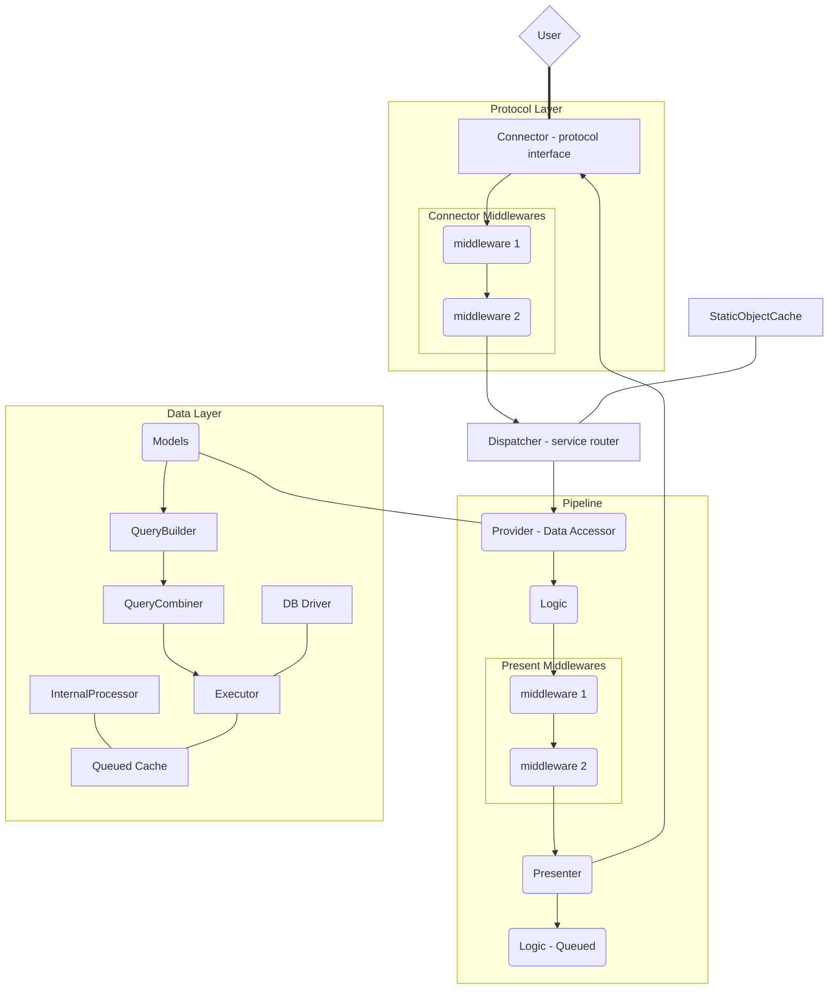

# Concept of Saphon

[TOC]

## Overview

Saphon is a wonderful, powerful server developing framework for PHP.

## Architecture

Saphon doesn’t follow MVC, MVVM or other things. It focuses on server development.

Look at this graph:

### Request Abstraction

A request is abstracted to a `Message`, a connection or a couple of requests are abstracted to a `Session`.

Several `Message`s can be combined to a `MessageCollection`.

There’s `SessionCollection` as well.
